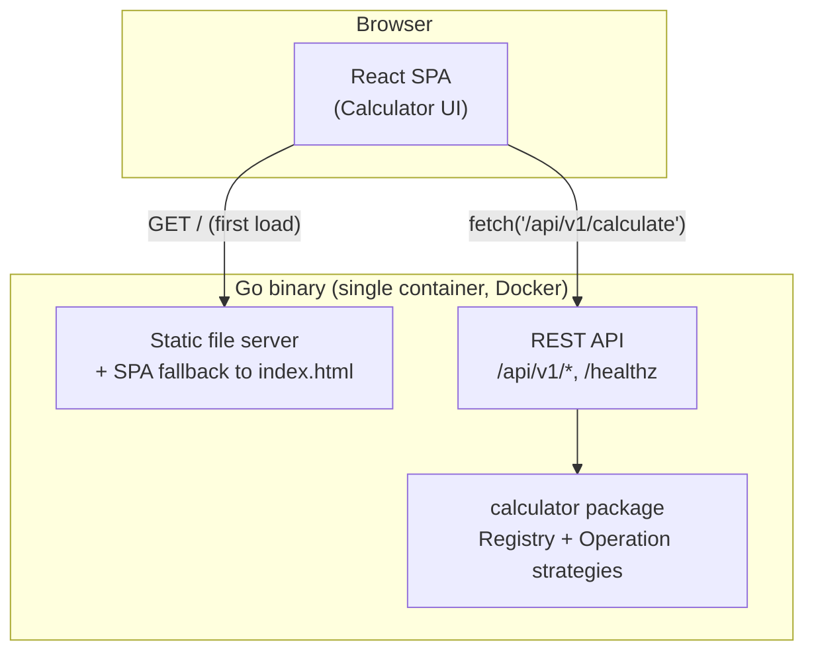

# Sezzle Calculator

A full-stack calculator: a Go (standard-library-only) REST microservice and a React +
TypeScript frontend, served together from a single container.

## Overview

- **`backend/`** — Go REST API. `internal/calculator` is the pure math domain (no HTTP
  awareness); `internal/api` is the HTTP layer (handlers, DTOs, middleware, error
  mapping). Operations are a strategy pattern behind a `Registry`: adding one means one
  new `Operation` type plus one `Register` call, no handler changes.
- **`frontend/`** — React + TypeScript (Vite). `api/client.ts` is the only module aware
  of the HTTP contract; `hooks/useCalculator.ts` is an immediate-execution state
  machine; `components/` are presentational only.
- In production (Docker), the Go binary serves both: the API under `/api/`, and the
  built frontend from `/`, with single-page-app routing fallback.

## Architecture



In local development, the frontend and backend run as two separate processes: Vite's
dev server proxies `/api/*` to the Go server (see `vite.config.ts`), so the browser
only ever talks to one origin either way.

## Prerequisites

- **Docker** (recommended path) — Docker Desktop with WSL2 integration, or any Docker
  Engine.
- **Native path** — Go 1.23+, Node 20+ / npm 10+, GNU Make (optional, just wraps the
  plain commands below).

## Run with Docker (recommended)

```bash
docker compose up --build
```

Then open <http://localhost:8080>. The same origin serves the SPA and the API, so
there's nothing else to configure. Stop with `Ctrl+C`, or `docker compose down`.

## Run natively

### Backend

```bash
cd backend
go run ./cmd/server
```

Serves on `:8080` by default. Override with `PORT=9000 go run ./cmd/server`. Env vars:

| Var | Default | Purpose |
|---|---|---|
| `PORT` | `8080` | Listen port |
| `STATIC_DIR` | *(unset)* | If set, also serves a built frontend from this directory with SPA fallback (used by the Docker image; leave unset for API-only local dev) |

### Frontend

```bash
cd frontend
npm install
npm run dev
```

Serves on <http://localhost:5173>, proxying `/api/*` to `http://localhost:8080` (the
backend above). Override the proxy target with `BACKEND_PROXY_TARGET=http://localhost:9000 npm run dev`.

### Make shortcuts (optional)

Every native command above has a `make` equivalent: `make run-backend`,
`make run-frontend`, `make build`, `make test`, `make lint`, `make coverage`,
`make docker-build`, `make docker-run`. They're thin wrappers — see the [Makefile](Makefile)
for the exact underlying commands, which are also listed below.

## Tests and coverage

```bash
# Backend
cd backend
go vet ./...
go test ./internal/... -cover

# Frontend
cd frontend
npm run typecheck
npm run lint
npm run test              # or: npm run test:coverage
npm run build
```

CI (`.github/workflows/ci.yml`) runs all of the above on every push/PR, plus a Docker
build, and **hard-fails the backend job if coverage on `internal/...` drops below 90%**.
Current committed snapshots (regenerate with `make coverage`; HTML reports are
gitignored and stay local):

- [`docs/coverage/backend.txt`](docs/coverage/backend.txt) — 97.6% (`go tool cover -func`)
- [`docs/coverage/frontend.txt`](docs/coverage/frontend.txt) — 94.07% statements, 100% functions (`vitest --coverage`)

## API reference

```
POST /api/v1/calculate   {"operation":"<name>","operands":[<float>,...]}  -> 200 {"result":<float>}
GET  /api/v1/operations  -> 200 {"operations":[{"name":"add","arity":{"min":2,"max":2}}, ...]}
GET  /healthz            -> 200 {"status":"ok"}
```

Operations: `add`, `subtract`, `multiply`, `divide`, `power` (exactly 2 operands each),
`sqrt` (1 operand), `percentage` (2 operands, see [Design decisions](#design-decisions)).

Errors: `{"error":{"code":"<CODE>","message":"<string>"}}`

| Code | HTTP | Meaning |
|---|---|---|
| `INVALID_JSON` | 400 | Malformed JSON, a `null` inside `operands`, a number sent as a string, or trailing data after the JSON object |
| `UNKNOWN_FIELD` | 400 | Body has a field other than `operation`/`operands` |
| `MISSING_FIELD` | 400 | `operation` is absent or empty |
| `UNKNOWN_OPERATION` | 400 | `operation` isn't one of the 7 supported names |
| `INVALID_OPERAND_COUNT` | 400 | Wrong number of operands — **including** `operands` absent or `[]` (see [Design decisions](#design-decisions)) |
| `UNSUPPORTED_MEDIA_TYPE` | 415 | `Content-Type` missing, not `application/json`, or malformed |
| `REQUEST_TOO_LARGE` | 413 | Body exceeds the 1 KiB cap |
| `DIVISION_BY_ZERO` | 422 | `divide` with a zero second operand |
| `MATH_DOMAIN_ERROR` | 422 | e.g. `sqrt` of a negative number, or `power` with a negative base and fractional exponent |
| `RESULT_OUT_OF_RANGE` | 422 | Result overflows to ±Infinity |
| `NOT_FOUND` | 404 | Unmatched route under `/api/` |
| `METHOD_NOT_ALLOWED` | 405 | Wrong HTTP method on a known `/api/` route (response includes an `Allow` header) |

### curl examples — every operation

```bash
H='Content-Type: application/json'; B='http://localhost:8080/api/v1/calculate'

curl -s -H "$H" -d '{"operation":"add","operands":[2,3]}' $B            # {"result":5}
curl -s -H "$H" -d '{"operation":"subtract","operands":[10,4]}' $B      # {"result":6}
curl -s -H "$H" -d '{"operation":"multiply","operands":[6,7]}' $B       # {"result":42}
curl -s -H "$H" -d '{"operation":"divide","operands":[10,4]}' $B        # {"result":2.5}
curl -s -H "$H" -d '{"operation":"power","operands":[2,10]}' $B         # {"result":1024}
curl -s -H "$H" -d '{"operation":"sqrt","operands":[16]}' $B            # {"result":4}
curl -s -H "$H" -d '{"operation":"percentage","operands":[20,50]}' $B   # {"result":10}

curl -s http://localhost:8080/api/v1/operations
curl -s http://localhost:8080/healthz
```

### curl examples — every error code

```bash
curl -s -H "$H" -d '{"operation":"divide","operands":[5,0]}' $B
# {"error":{"code":"DIVISION_BY_ZERO","message":"division by zero"}}  [422]

curl -s -H "$H" -d '{"operation":"sqrt","operands":[-4]}' $B
# {"error":{"code":"MATH_DOMAIN_ERROR","message":"operation is undefined for the given operands"}}  [422]

curl -s -H "$H" -d '{"operation":"power","operands":[10,400]}' $B
# {"error":{"code":"RESULT_OUT_OF_RANGE","message":"result is not a finite number"}}  [422]

curl -s -H "$H" -d '{"operation":"add","operands":[1]}' $B
# {"error":{"code":"INVALID_OPERAND_COUNT","message":"invalid operand count for this operation"}}  [400]

curl -s -H "$H" -d '{"operation":"modulo","operands":[1,2]}' $B
# {"error":{"code":"UNKNOWN_OPERATION","message":"unknown operation"}}  [400]

curl -s -H "$H" -d '{"operands":[1,2]}' $B
# {"error":{"code":"MISSING_FIELD","message":"operation is required"}}  [400]

curl -s -H "$H" -d '{"operation":"add","operands":[1,2]' $B
# {"error":{"code":"INVALID_JSON","message":"request body is not valid JSON"}}  [400]

curl -s -H "$H" -d '{"operation":"divide","operands":[1,null]}' $B
# {"error":{"code":"INVALID_JSON","message":"operand at index 1 must be a number, not null"}}  [400]

curl -s -H "$H" -d '{"operation":"add","operands":[1,2],"extra":1}' $B
# {"error":{"code":"UNKNOWN_FIELD","message":"request body contains an unknown field"}}  [400]

curl -s -d '{"operation":"add","operands":[1,2]}' $B   # no Content-Type header
# {"error":{"code":"UNSUPPORTED_MEDIA_TYPE","message":"Content-Type must be application/json"}}  [415]

python3 -c "print('{\"operation\":\"add\",\"operands\":['+'1,'*600+'1]}')" | curl -s -H "$H" --data-binary @- $B
# {"error":{"code":"REQUEST_TOO_LARGE","message":"request body too large"}}  [413]

curl -s http://localhost:8080/api/v1/nonexistent
# {"error":{"code":"NOT_FOUND","message":"resource not found"}}  [404]

curl -s http://localhost:8080/api/v1/calculate   # GET on a POST-only route
# {"error":{"code":"METHOD_NOT_ALLOWED","message":"method not allowed"}}  [405], with an Allow: POST header
```

All of the above were run against a live `go run ./cmd/server` to confirm the exact
output before writing this README.

## Design decisions

- **Immediate-execution input model (frontend).** The calculator behaves like a
  physical pocket calculator, not an expression parser: `2 + 3 × 4 =` evaluates
  left-to-right to `20`, not `14`, because each operator resolves the previous one as
  soon as the next operator (or `=`) is pressed. `sqrt` is unary and applies
  immediately to whatever's on screen without disturbing a pending chain; `percentage`
  is a regular binary chain operator like `+`/`×` (not a special unary `/100` key),
  because the backend's percentage contract is fixed-binary and this keeps one code
  path for every operator. The frontend never does math itself — every number on
  screen came from an API response.
- **`percentage(a, b) = a*b/100`, not `(a/100)*b`.** Code review caught that the
  original formula produced rounding artifacts for whole-number results — e.g.
  `percentage(7, 100)` came out `7.000000000000001` and `percentage(29, 100)` came out
  `28.999999999999996`, because `7/100` isn't exact in float64 but `7*100/100` is.
  Multiplying before dividing fixes the common case while still overflowing to
  `RESULT_OUT_OF_RANGE` the same way for extreme inputs. See
  `backend/internal/calculator/percentage.go` and its regression tests.
- **float64, not a decimal library.** Every operand and result is `float64`. This means
  standard IEEE-754 rounding artifacts are possible — `add(0.1, 0.2)` returns
  `0.30000000000000004`, not `0.3`, and `add_test.go` asserts exactly that value on
  purpose, as a documented trade-off rather than a bug. A decimal/bignum library would
  remove this class of surprise but adds a dependency and complexity not justified by
  this assignment's scope (not a financial ledger product).
- **400 / 413 / 415 / 422 split.** 400 means the request itself is malformed or
  structurally wrong (fix it and resubmit as-is). 413 and 415 are transport-level
  rejections that exist independently of JSON content (body too big, wrong media
  type) — standard HTTP statuses for exactly those conditions, kept distinct from the
  generic 400 bucket. 422 means the request was well-formed JSON with a valid
  operation and operand count, but the specific arithmetic is undefined or
  unrepresentable.
- **`Registry.Calculate` owns every cross-cutting math/contract rule.** Arity
  validation, NaN → `MATH_DOMAIN_ERROR`, ±Inf → `RESULT_OUT_OF_RANGE`, and negative-zero
  normalization (so the API never serializes `"-0"`) all live in one place
  (`internal/calculator/registry.go`), tested against stub operations independent of
  any real operation's math. Each `Operation.Apply` stays pure arithmetic; the API
  handler stays a thin translation layer. Adding operation #8 gets all of this for
  free.
- **Hand-written `vi.mock` over MSW.** Component/hook tests mock `api/client.ts`
  directly rather than intercepting at the network layer. The typed client is a thin,
  fully-owned abstraction — the entire point of the `api/` layer is to isolate the HTTP
  shape — so mocking at the module boundary is simpler to write and maintain, and the
  client's own request/response handling is separately covered by tests that stub
  `global.fetch`. MSW's realism benefit is redundant here.
- **Alpine, not distroless, for the final Docker image.** Distroless has no shell, so
  `docker-compose`'s container-exec healthcheck (`CMD wget ...`) can't run inside it.
  Alpine's busybox `wget` makes the required `/healthz` healthcheck possible while
  still running as a dedicated non-root user — the pragmatic choice given the
  healthcheck requirement.
- **`STATIC_DIR` env var.** Empty by default (API-only — every backend test runs this
  way). Set to `/app/static` in the Docker image to additionally serve the built
  frontend with SPA fallback. `/api/` and `/healthz` always take precedence over the
  static handler, even for unmatched `/api/` paths (tested explicitly in
  `static_test.go`), so the SPA fallback can never shadow a real or mistyped API call.

## Assumptions

- `operands` absent entirely and `operands: []` both resolve to `INVALID_OPERAND_COUNT`,
  not `MISSING_FIELD` — `MISSING_FIELD` is reserved for an absent/empty `operation`,
  since operand-count validation already happens for free in `Registry.Calculate`.
- A JSON `null` inside `operands`, or a number sent as a JSON string, both map to
  `INVALID_JSON` rather than a distinct code — both are "not a valid JSON number,"
  same bucket as syntactic malformation.
- Oversized-body cap is 1 KiB — arbitrary but generous for a handful of floats and an
  operation name.
- CORS is permissive (`Access-Control-Allow-Origin: *`) for local-dev convenience; not
  a production security posture, since this ships as a single same-origin container.
- 404/405 under non-`/api/` paths (i.e. `/`) keep Go's default plain-text body — `/` is
  reserved for the SPA from Phase 4 onward, so it's deliberately not wrapped in the
  JSON error envelope.
- Equals with an empty second operand (e.g. `5 + =`) repeats the first operand
  (`add(5,5)`), matching common physical-calculator behavior.
- Keyboard binding for √ is `r`/`R` — there's no standard physical key for square root.

## What I'd do with more time

- **Operator precedence via an expression endpoint.** The current contract is
  intentionally simple (one operation + its operands per request), which is what
  drives the immediate-execution-only frontend. A `POST /api/v1/evaluate
  {"expression": "2 + 3 * 4"}` endpoint with real precedence would let the frontend
  support conventional calculator input too.
- **Decimal arithmetic.** Swap `float64` for a decimal library (e.g. `shopspring/decimal`)
  behind the same `Operation` interface if this ever needed to be precision-exact for
  money — the strategy pattern means this is a contained change.
- **End-to-end tests with Playwright.** Everything here is tested at the unit/component
  level (Go table-driven + httptest, Vitest + RTL) plus manual curl/browser
  verification; a real browser-driven E2E suite against the Docker image would close
  the gap between "the parts work" and "the assembled thing works" — no headless
  browser tool was available in the development sandbox to set this up during the
  session itself.
- **Operation history / a tape view** — the Ledger Tape visual design already shows a
  running expression line; persisting a scrollable history of past calculations would
  extend that idea naturally.

## AI usage

This project was built with Claude Code, working in phases with human approval between
each one. [`CLAUDE.md`](CLAUDE.md) holds the working agreement (git conventions, phase
workflow, report format); [`PROMPTS.md`](PROMPTS.md) is the author's own log of the
prompts and decisions across the session.
